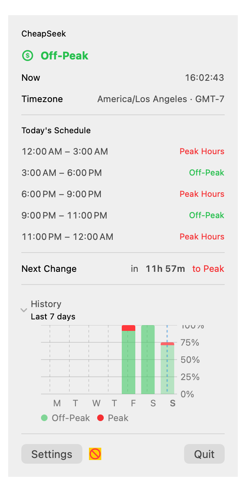
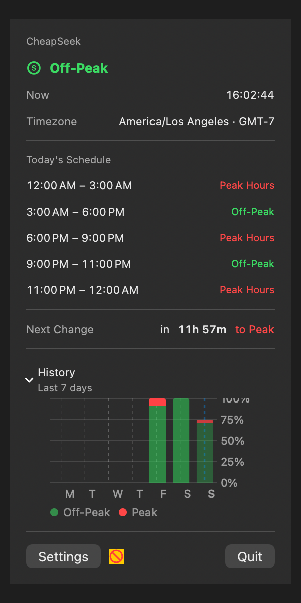
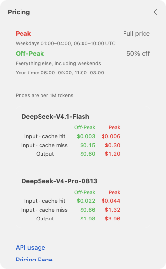
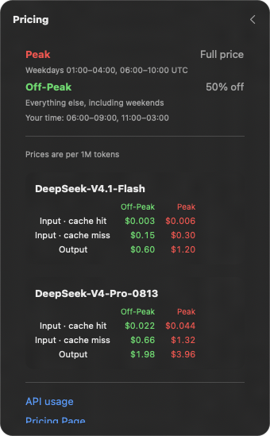
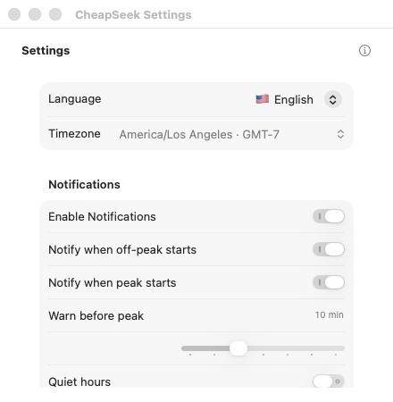
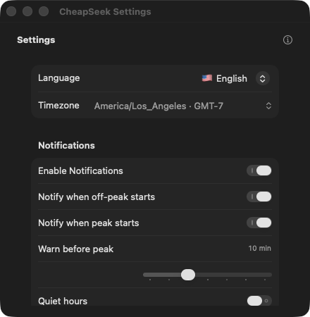
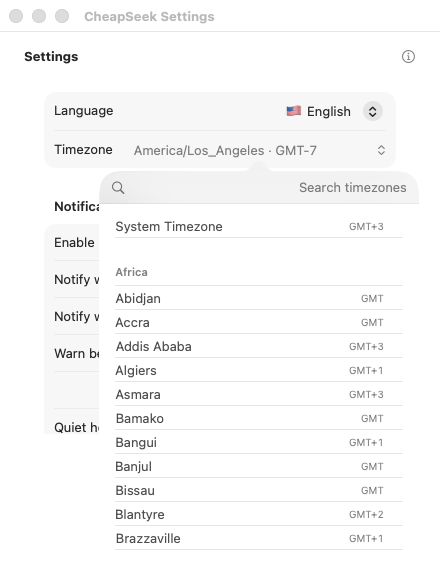
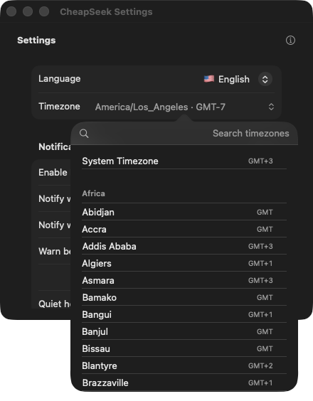
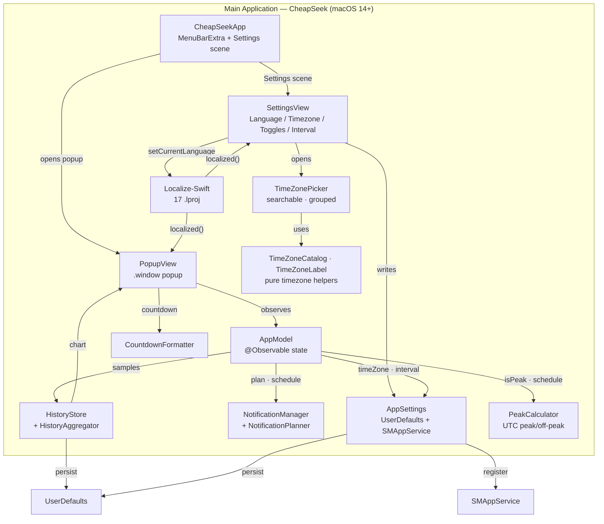

# CheapSeek

> Never pay peak prices for DeepSeek API again.

**CheapSeek** is a tiny macOS menu bar app that tells you, at a glance, whether the DeepSeek API is currently in **peak** (expensive) or **off-peak** (cheap) pricing.

When it's cheap, you code. When it's expensive, you wait. Simple.

> **DEV MODE:** The project is currently **ad-hoc signed** (`CODE_SIGN_IDENTITY: "-"` in `project.yml`). Because of this, `SMAppService` launch-at-login may fail to register, and macOS may print harmless `com.apple.linkd.autoShortcut` connection messages at launch. Sign with a Development Team for properly signed builds.

---

## 🛠️ Tech Stack & Architecture

- **Language & Framework:** Swift 5.9 / SwiftUI, macOS 14+, `MenuBarExtra` popup (`.window` style)
- **Architecture Pattern:** Clean separation — pure core (`PeakCalculator`, `CountdownFormatter`, `NotificationPlanner`, `HistoryAggregator`, `TimeZoneCatalog`, `TimeZoneLabel`), state (`AppModel`, `AppSettings`, `Clock`, `HistoryStore`, `NotificationManager`), config (`DeepSeekConfig`), and views (`PopupView`, `SettingsView`, `PricingInfoView`, `HistoryChartView`, `TimeZonePicker`, `MenuBarLabel`)
- **Peak Engine:** Pure Foundation `PeakCalculator` — UTC Gregorian calendar, half-open windows (`[01:00,04:00)` & `[06:00,10:00)`, Mon–Fri; weekends off-peak)
- **State & Settings:** `AppModel` (`@Observable`, async `Clock` tick) + `AppSettings` (`UserDefaults` persistence, `SMAppService` launch-at-login)
- **Localization:** 17 languages (EN / TR / DE / ES / PT / FR / IT / ZH-Hans / HI / BN / RU / ID / MS / JA / KO / VI / SW) via vendored [Localize-Swift](https://github.com/marmelroy/Localize-Swift) (MIT); live switching through `LCLLanguageChangeNotification`; system language auto-detected with English fallback
- **Design:** Semantic system colors, `.regularMaterial` popup background, light & dark mode follow the system automatically
- **Testing:** XCTest unit tests (207, incl. security, config, ViewInspector and ImageRenderer view tests) + XCUITest (app launch + best-effort menu bar checks)
- **Project Generation:** Declarative `project.yml` managed with [XcodeGen](https://github.com/yonaskolb/XcodeGen) for reproducible builds
- **Dependency:** [Localize-Swift](https://github.com/marmelroy/Localize-Swift) 3.2.0 (MIT, by [Roy Marmelstein](https://github.com/marmelroy); vendored — see note in `project.yml`)
- **Bundle ID:** `com.labrus.CheapSeek`

---

## ✨ Features

- 🟢 **Live status in your menu bar** — `leaf` + `cheap` when off-peak, `flame.fill` + `peak` when expensive (text + symbol, readable even when macOS renders the status item as a monochrome template)
- 🧮 **Accurate peak logic** — UTC weekdays `01:00–04:00` & `06:00–10:00`, weekends always off-peak
- 🕐 **Timezone-aware** — peak hours computed in UTC, displayed in your local (configurable) timezone
- 🧭 **Searchable timezone picker** — all IANA zones grouped by region with instant search and live UTC offsets
- 📅 **Today's full schedule** — every peak/off-peak window for the day
- ⏳ **Next transition countdown** — "Next change in 3h 42m (to PEAK)", ticking live every second
- 🌍 **17 languages** — English 🇺🇸, Turkish 🇹🇷, German 🇩🇪, Spanish 🇪🇸, Portuguese 🇵🇹, French 🇫🇷, Italian 🇮🇹, Chinese (Simplified) 🇨🇳, Hindi 🇮🇳, Bengali 🇧🇩, Russian 🇷🇺, Indonesian 🇮🇩, Malay 🇲🇾, Japanese 🇯🇵, Korean 🇰🇷, Vietnamese 🇻🇳, Swahili 🇹🇿
- ⚙️ **Settings** — language, searchable timezone picker, notifications (permission, before-peak warning, transition alerts, quiet hours), launch at login, refresh interval (30–300s)
- 💰 **Pricing info** — DeepSeek model rates (peak/off-peak, per 1M tokens) with links to the pricing page and API docs
- 🌗 **Light & dark mode** — follows your system appearance automatically
- 🪶 **Minimal** — release build under 1 MB
- 🔔 **Local notifications** — an optional 5-minute warning before peak and/or an alert when off-peak starts, scheduled entirely on-device with quiet-hours support
- 📊 **7-day history** — a collapsible stacked-bar chart of peak vs. off-peak minutes for the last 7 days, built from on-device state changes (no network)
- 🔒 **No tracking, no telemetry, no network calls**

---

## 📸 Screenshots

All screenshots use the English UI with a sample timezone (`America/Los_Angeles`). Click a thumbnail to open the full-size image.

| | Light | Dark |
| :--- | :---: | :---: |
| **Popup** | <a href="docs/screenshots/light/popup.png" target="_blank" rel="noopener"></a> | <a href="docs/screenshots/dark/popup.png" target="_blank" rel="noopener"></a> |
| **Pricing** | <a href="docs/screenshots/light/pricing.png" target="_blank" rel="noopener"></a> | <a href="docs/screenshots/dark/pricing.png" target="_blank" rel="noopener"></a> |
| **Settings** | <a href="docs/screenshots/light/settings.png" target="_blank" rel="noopener"></a> | <a href="docs/screenshots/dark/settings.png" target="_blank" rel="noopener"></a> |
| **Timezone picker** | <a href="docs/screenshots/light/timezone-picker.png" target="_blank" rel="noopener"></a> | <a href="docs/screenshots/dark/timezone-picker.png" target="_blank" rel="noopener"></a> |

---

## 🆕 What's new

- **Text-based menu bar indicator** — `leaf` + `cheap` / `flame.fill` + `peak` replaces the color-only icon, so the status stays readable in light, dark, and monochrome template mode.
- **Local peak/off-peak notifications** — an optional warning before peak, an off-peak-start alert, and quiet hours, scheduled entirely on-device.
- **7-day history chart** — a collapsible stacked-bar chart of daily peak vs. off-peak minutes in the popup.
- **Accurate 7-day history** — gaps while the app was closed are backfilled on launch.
- **Searchable timezone picker** — every IANA zone grouped by region, with instant search and live UTC offsets.
- **Grouped settings layout** — macOS System Settings–style sections with comfortable spacing.
- **Live language switching** — the popup, settings, menu bar, and pending notifications update instantly, no relaunch.
- **17 languages**, no tracking, and no network calls.

---

## 🏗️ Architecture



### Data Flow Summary

1. **Refresh tick** — `AppModel` runs an async `Clock` tick at the configured interval (default 60s) and computes `isPeak` + today's schedule via `PeakCalculator` (UTC).
2. **Menu bar update** — the observable `isPeak` drives the label: `leaf` + `cheap` when off-peak, `flame.fill` + `peak` when peak — short text and a neutral symbol instead of color, so it stays readable in light, dark, and monochrome template mode.
3. **Popup render** — `PopupView` wraps content in a 1s `TimelineView`; each second it recomputes the next transition and the countdown via `CountdownFormatter`.
4. **Settings change** — `SettingsView` writes `AppSettings` (UserDefaults); timezone/interval updates propagate to `AppModel` through the Observation framework, and the views re-render live.
5. **Launch at login** — toggled via `SMAppService.mainApp` (`register()` / `unregister()`).
6. **Notifications** — on launch and on any notification/timezone setting change, `AppModel` asks `NotificationPlanner` for the upcoming transitions over a 7-day horizon; `NotificationManager` cancels pending requests and re-schedules them as local notifications, skipping quiet hours. If permission is denied it clears pending requests and the Settings screen points the user to System Settings.
7. **History** — `Clock` calls back on every tick; `AppModel` records the current state through `HistoryStore` only when it changes (one JSON blob in `UserDefaults`, pruned to 7 days with a boundary anchor). `HistoryAggregator` turns the samples into per-day peak/off-peak minutes, and `HistoryChartView` renders them for the selected timezone.

---

## 🚀 Installation & Quick Start

### 1. Prerequisites

| Requirement | Version / Notes |
| :--- | :--- |
| **macOS** | 14.0+ |
| **Xcode** | 15.0+ |
| **Project Generator** | [XcodeGen](https://github.com/yonaskolb/XcodeGen) (`brew install xcodegen`) |

### 2. Configure Settings in App

No hardcoded bundle identifiers or provisioning profiles are required. On launch the app reads saved settings (`AppSettings`); if none, it uses sensible defaults. In Settings you can change:

1. **Language** — defaults to the system language; if unsupported, falls back to English. Changes apply instantly (no relaunch).
2. **Timezone** — defaults to the system timezone; pick any IANA identifier.
3. **Notifications** — enable peak/off-peak alerts, a warning before peak, transition alerts, and quiet hours.
4. **Refresh interval** — 30–300s (default 60s).
5. **Launch at login** — via `SMAppService`.

### 3. Run & Build

1. Generate the project first: `xcodegen generate` (`project.yml` is canonical — never edit the `.xcodeproj` by hand).
2. Open `CheapSeek.xcodeproj` in Xcode.
3. Press `Cmd + R` to build and run.

> **Note on code signing:** Local builds are ad-hoc signed. `SMAppService` launch-at-login can fail until the app is signed with a Development Team (and, for distribution, notarized). See the **DEV MODE** note at the top.

---

## 📦 Building a Release

The project is generated from `project.yml` by XcodeGen, so always regenerate before a release build.

> **Signing prerequisite:** A distributable build must be signed with a **Developer ID Application** certificate (direct download) or an **Apple Distribution** certificate (Mac App Store). For local builds, set `DEVELOPMENT_TEAM` in `project.yml` first — see the **DEV MODE** note at the top.

### 1. Generate the project

```bash
xcodegen generate
```

### 2. Build the Release app

```bash
xcodebuild build -project CheapSeek.xcodeproj -scheme CheapSeek \
  -configuration Release -derivedDataPath build
```

The app is produced at `build/Build/Products/Release/CheapSeek.app`; drag it into `/Applications` to run it.

### 3. Archive

```bash
xcodebuild archive -project CheapSeek.xcodeproj -scheme CheapSeek \
  -configuration Release -archivePath build/CheapSeek.xcarchive
```

This creates `build/CheapSeek.xcarchive` (the app is under `Products/Applications/`).

### 4. Distribute

- **Direct download (outside the App Store):** export with the Developer ID method, then notarize and staple:

  > `ExportOptions.plist` is **not** committed — create it with `method: developer-id` and your `teamID` before exporting.

  ```bash
  xcodebuild -exportArchive -archivePath build/CheapSeek.xcarchive \
    -exportOptionsPlist ExportOptions.plist -exportPath build/export
  ditto -c -k --keepParent build/export/CheapSeek.app build/CheapSeek.zip
  xcrun notarytool submit build/CheapSeek.zip --keychain-profile "notary" --wait
  xcrun stapler staple build/export/CheapSeek.app
  ```

- **Mac App Store / macOS TestFlight:** export the archive with `method: app-store` and upload via Xcode Organizer or Transporter.

---

## 📂 Project Structure

```
CheapSeek/
├── project.yml                          # XcodeGen declarative project spec (single source of truth)
├── CheapSeek.xcodeproj/                # Generated project (do not edit by hand)
├── CheapSeek/                           # Main app target
│   ├── CheapSeekApp.swift               # @main entry: MenuBarExtra + Settings scene
│   ├── AppModel.swift                   # @Observable: peak status, schedule, clock-driven updates
│   ├── Clock.swift                      # Async ticker (no Timer/Combine)
│   ├── AppSettings.swift                # UserDefaults-backed settings, notifications prefs + SMAppService
│   ├── NotificationManager.swift        # Permission state + schedules transition notifications
│   ├── NotificationPlanner.swift        # Pure peak/off-peak notification planning + quiet hours
│   ├── HistoryStore.swift               # Event-based, on-device peak/off-peak history (UserDefaults)
│   ├── HistoryAggregator.swift          # Pure per-day peak/off-peak minute aggregation
│   ├── HistoryChartView.swift           # SwiftUI Charts stacked bar (last 7 days)
│   ├── PeakCalculator.swift             # Pure UTC peak/off-peak logic
│   ├── PeakStatus.swift                 # PeakStatus enum + reusable PeakStatusBadge
│   ├── DesignSystem.swift               # Shared spacing/layout tokens
│   ├── MenuBarLabel.swift               # Menu bar icon/label with accessibility
│   ├── CountdownFormatter.swift         # Localized countdown formatting
│   ├── TimeZoneLabel.swift              # Pretty timezone names + live UTC offsets
│   ├── TimeZoneCatalog.swift            # Pure grouped/searchable timezone catalog
│   ├── AppLanguage.swift                # Single source of truth for the 17 languages
│   ├── DeepSeekConfig.swift             # Loads Configuration.plist (peak hours, prices, links)
│   ├── Configuration.plist              # Bundled config: peak windows, model pricing, links
│   ├── PrivacyInfo.xcprivacy            # Privacy manifest (UserDefaults reason CA92.1)
│   ├── PopupView.swift                  # Menu bar popup (status, schedule, countdown, history, actions)
│   ├── SettingsView.swift               # Settings screen (language, timezone, toggles, interval)
│   ├── TimeZonePicker.swift             # Searchable, region-grouped timezone picker
│   ├── PricingInfoView.swift            # Pricing/info sheet (models, peak/off-peak rates, links)
│   ├── Assets.xcassets/                 # App icon + accent color
│   ├── en.lproj/Localizable.strings     # English (66 keys)
│   ├── tr.lproj/Localizable.strings     # Turkish
│   ├── de.lproj/Localizable.strings     # Deutsch
│   ├── es.lproj/Localizable.strings     # Español
│   ├── pt.lproj/Localizable.strings     # Português
│   ├── fr.lproj/Localizable.strings     # Français
│   ├── it.lproj/Localizable.strings     # Italiano
│   ├── zh-Hans.lproj/Localizable.strings # 简体中文
│   ├── hi.lproj/Localizable.strings     # हिन्दी
│   ├── bn.lproj/Localizable.strings     # বাংলা
│   ├── ru.lproj/Localizable.strings     # Русский
│   ├── id.lproj/Localizable.strings     # Bahasa Indonesia
│   ├── ms.lproj/Localizable.strings     # Bahasa Melayu
│   ├── ja.lproj/Localizable.strings     # 日本語
│   ├── ko.lproj/Localizable.strings     # 한국어
│   ├── vi.lproj/Localizable.strings     # Tiếng Việt
│   └── sw.lproj/Localizable.strings     # Kiswahili
├── Packages/Localize-Swift/             # Vendored Localize-Swift 3.2.0 (local SPM package)
├── CheapSeekTests/                      # Unit tests
│   ├── PeakCalculatorTests.swift        # Peak logic, boundaries, weekends, DST
│   ├── AppSettingsTests.swift           # Defaults, clamping, persistence
│   ├── AppModelTests.swift              # State computation with injected date/timezone
│   ├── CountdownFormatterTests.swift    # Localized countdown units
│   ├── MenuBarLabelTests.swift          # Menu bar status text + symbol
│   ├── NotificationManagerTests.swift   # Scheduling via a mock notification center
│   ├── NotificationPlannerTests.swift   # Transition planning + quiet hours
│   ├── HistoryAggregatorTests.swift     # Daily aggregation, timezones, DST
│   ├── HistoryStoreTests.swift          # Event-based recording, retention, persistence
│   ├── LocalizationTests.swift          # 17-language key parity & completeness
│   ├── PricingConfigTests.swift         # Bundled config parsing + fallback schedule
│   ├── TimeZoneCatalogTests.swift       # Grouping, offsets, and search filtering
│   ├── TimeZoneLabelTests.swift         # Pretty names, offsets, and DST
│   └── SecurityRegressionTests.swift    # OWASP/MASVS regression (entitlements, network, l10n)
├── CheapSeekUITests/                    # UI tests (XCUITest)
│   └── CheapSeekUITests.swift           # App launch + best-effort menu bar checks
├── test/test.sh                         # Test runner (xcodegen + xcodebuild test)
├── test/TestResults/                    # .xcresult bundles (gitignored; .empty keeps the dir)
├── .github/workflows/ci.yml             # CI: generate, build, unit tests + coverage gate
├── TESTING.md                           # Test strategy, runner, UI tests, coverage
├── SECURITY.md                          # OWASP/MASVS security & privacy report
├── CONTRIBUTING.md                      # Setup, testing, commit conventions
├── docs/diagrams/                       # Archify diagrams (interactive HTML + JSON)
│   ├── cheapseek-architecture.html      # Components and boundaries
│   ├── cheapseek-dataflow.html          # How data moves through the app
│   └── cheapseek-workflow.html          # Runtime workflow and life cycle
├── docs/screenshots/                    # English UI screenshots (used in README)
│   ├── light/                           # popup, pricing, settings, timezone-picker
│   └── dark/                            # popup, pricing, settings, timezone-picker
├── README.md
└── logs/                                # Raw test logs (gitignored; .empty keeps the dir)
```

---

## 🧪 Testing & CI

```bash
./test/test.sh --list                 # show the plan without running
./test/test.sh                        # unit tests (xcodegen generate + xcodebuild test)
./test/test.sh --ui                   # include the UI tests (local only)
./test/test.sh --coverage             # unit tests + coverage summary
```

- Suites: `PeakCalculatorTests` (39), `CountdownFormatterTests` (7), `AppSettingsTests` (7), `AppModelTests` (9), `MenuBarLabelTests` (6), `NotificationManagerTests` (7), `NotificationPlannerTests` (11), `HistoryAggregatorTests` (11), `HistoryStoreTests` (17), `LocalizationTests` (4), `PricingConfigTests` (6), `TimeZoneCatalogTests` (6), `TimeZoneLabelTests` (5), `DeepSeekConfigTests` (9), `ClockTests` (3), `AppLanguageTests` (2), `PeakStatusTests` (6), plus ViewInspector suites (`PricingInfoViewTests`, `PopupViewTests`, `SettingsViewTests`, `TimeZonePickerTests`, `HistoryChartViewTests`) and system-boundary tests — **207 unit tests**, plus `CheapSeekUITests` (app launch + best-effort menu bar checks).
- UI tests are **local-only**; on macOS the `MenuBarExtra` status item is not always exposed to accessibility, so the popup/settings checks **skip (`XCTSkip`)** rather than fail.
- CI (`.github/workflows/ci.yml`, `macos-latest`): installs XcodeGen, regenerates the project, builds, runs the unit tests with coverage and enforces a **coverage gate** (`CheapSeek.app` ≥ 25%) on push / PR / manual dispatch. UI tests are local-only (macOS XCUITest needs an interactive session).
- Details: [TESTING.md](./TESTING.md) · Security: [SECURITY.md](./SECURITY.md) · Contributing: [CONTRIBUTING.md](./CONTRIBUTING.md).

---

## Documentation & Architecture

### Architecture Diagrams (Archify)
System architecture and visual documentation are generated with [Archify](https://github.com/tt-a1i/archify). Generated files live in [`docs/diagrams/`](./docs/diagrams) as interactive HTML visualizers plus their JSON definitions:

- **Architecture:** [`cheapseek-architecture.html`](./docs/diagrams/cheapseek-architecture.html) — component relationships and system structure
- **Data-Flow:** [`cheapseek-dataflow.html`](./docs/diagrams/cheapseek-dataflow.html) — how data moves through the app
- **Workflow & Lifecycle:** [`cheapseek-workflow.html`](./docs/diagrams/cheapseek-workflow.html) — runtime workflow and life cycle

### Project Documentation
- [TESTING.md](./TESTING.md) — test suites, runner, UI tests, and coverage.
- [SECURITY.md](./SECURITY.md) — OWASP Top 10, MASVS, threat model, and privacy posture.
- [CONTRIBUTING.md](./CONTRIBUTING.md) — development setup, tests, and commit conventions.

---

## 🔐 Permissions & Privacy

| Setting / Key | Purpose | Location |
| :--- | :--- | :--- |
| `LSUIElement = true` | Runs as a menu-bar-only app (no Dock icon) | `project.yml` → `INFOPLIST_KEY_LSUIElement` |
| `SMAppService.mainApp` | Optional launch-at-login (no deprecated login-item APIs) | `AppSettings.swift` |
| `UNUserNotificationCenter` | Local peak/off-peak alerts (no entitlement or network required) | `NotificationManager.swift` |
| _(no entitlements)_ | The app uses **no entitlements** and is not sandboxed | `project.yml` |
| `MARKETING_VERSION` / `CURRENT_PROJECT_VERSION` | `1.0.0` / `1` | `project.yml` |

> **Privacy:** CheapSeek makes **no network requests** and sends **no telemetry or analytics**. All state is stored locally in `UserDefaults` (timezone, notifications preferences, quiet hours, refresh interval, language, and the peak/off-peak history samples). Peak pricing is computed entirely on-device from the current UTC time, and notifications are scheduled locally by macOS.

**Version:** `CFBundleShortVersionString 1.0.0` (`CFBundleVersion 1`), set via `MARKETING_VERSION` / `CURRENT_PROJECT_VERSION` in `project.yml`.

### Known limitations

- **Menu bar appearance** — macOS may render the status item as a monochrome template; the indicator therefore uses short text (`cheap`/`peak`) plus distinct SF Symbols (`leaf`/`flame.fill`) instead of color, so it stays readable in light, dark, and template mode. The full status remains visible in the popup.
- **Launch at login** — depends on a properly signed build (ad-hoc signing may be rejected by `SMAppService`).
- **UI tests** — menu bar popup interaction is skipped (`XCTSkip`) when macOS does not expose the status item to accessibility.
- **Notifications** — local alerts are scheduled for the upcoming 7 days and refreshed when notification or timezone settings change; a notification only fires while the app is running or had already scheduled it. Delivery depends on macOS notification permission, and ad-hoc signed dev builds may not show the authorization prompt reliably. Quiet hours suppress alerts whose delivery time falls inside the configured window.
- **History** — samples are recorded only while the app is running, on state changes; time while the app was closed is backfilled on next launch using the same peak rules, so the chart stays accurate. The chart therefore becomes more meaningful the longer the app runs.
- **Countdown units** — the countdown uses short unit suffixes (`h`/`m`/`s`, localized per language) rather than full pluralized phrases, so languages with complex plural rules (e.g. Russian) show a single form. Charting/date math is unaffected.
- **Pricing/config updates** — model prices and peak windows live in `CheapSeek/Configuration.plist`; update that file when DeepSeek changes its rates. `DeepSeekConfigTests`/`PricingConfigTests` validate the file and fall back to built-in defaults if it is missing or malformed.

---

## 📄 License

This project is licensed under the MIT License.
