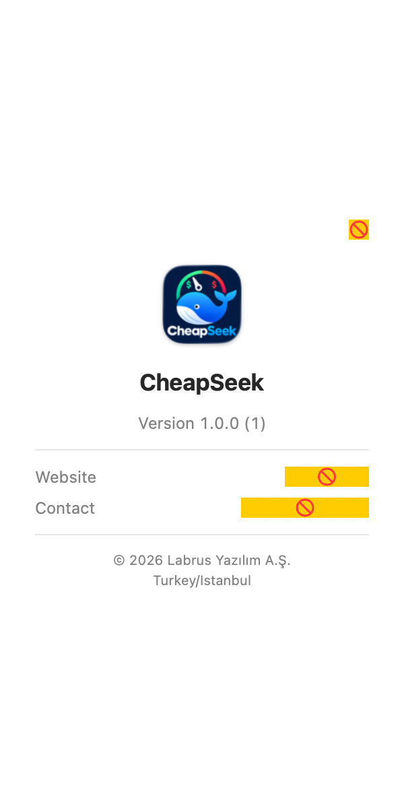
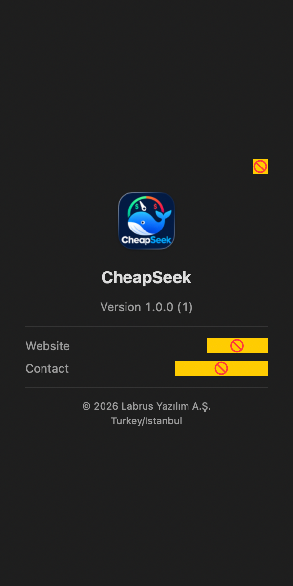
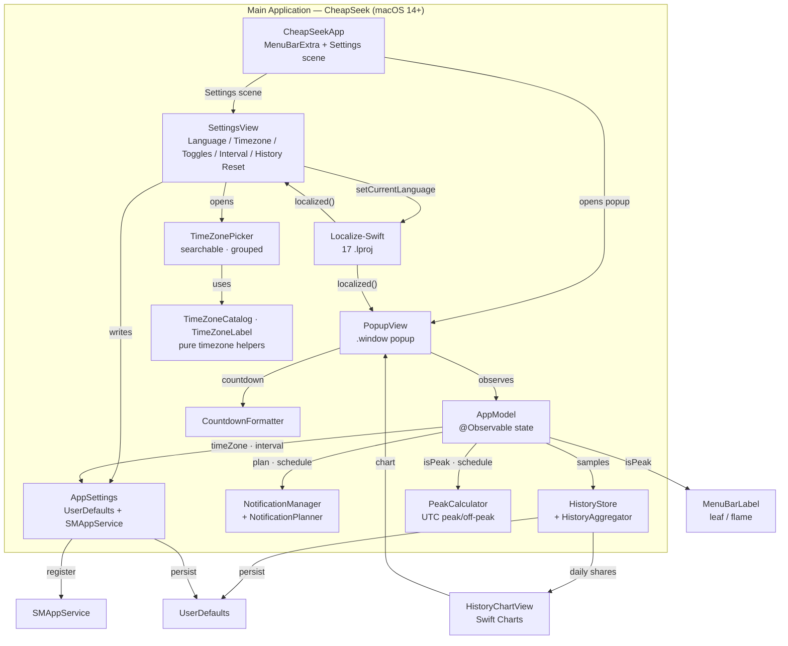

# CheapSeek

[](https://github.com/mahirfatih/cheapseek/actions/workflows/ci.yml)


**CheapSeek** is a tiny macOS menu bar app that tells you, at a glance, whether the DeepSeek API is currently in **peak** (expensive) or **off-peak** (cheap) pricing — never pay peak prices again. When it's cheap, you code; when it's expensive, you wait.

> **DEV MODE:** Without a `Config/Local.xcconfig`, the app is **ad-hoc signed** (`CODE_SIGN_IDENTITY = -` in `Config/Base.xcconfig`). Because of this, `SMAppService` launch-at-login may fail to register, and macOS may print harmless `com.apple.linkd.autoShortcut` connection messages at launch. Set your `DEVELOPMENT_TEAM` in `Config/Local.xcconfig` for a properly signed build — see [docs/RELEASE.md](./docs/RELEASE.md).

---

## 📖 Overview

CheapSeek turns DeepSeek's peak/off-peak pricing into a glanceable menu bar signal: a live status, today's schedule, a countdown to the next change, local notifications, and a 7-day history chart — computed entirely on-device from UTC rules, with 17 languages. Read the full walkthrough (how it works, the screens, the peak rules, the data layer, and the known limitations):

**[English →](./docs/OVERVIEW/EN.md) · [Türkçe →](./docs/OVERVIEW/TR.md)**

---

## 🛠️ Tech Stack & Architecture

- **Language & Framework:** Swift 5.9 / SwiftUI, macOS 14+, `MenuBarExtra` popup (`.window` style)
- **Architecture Pattern:** Clean separation — pure core (`PeakCalculator`, `CountdownFormatter`, `NotificationPlanner`, `HistoryAggregator`, `TimeZoneCatalog`, `TimeZoneLabel`), state (`AppModel`, `AppSettings`, `Clock`, `HistoryStore`, `NotificationManager`), config (`DeepSeekConfig`), and views (`PopupView`, `SettingsView`, `PricingInfoView`, `HistoryChartView`, `TimeZonePicker`, `MenuBarLabel`)
- **Peak Engine:** Pure Foundation `PeakCalculator` — UTC Gregorian calendar, half-open windows (`[01:00,04:00)` & `[06:00,10:00)`, Mon–Fri; weekends off-peak)
- **State & Settings:** `AppModel` (`@Observable`, async `Clock` tick) + `AppSettings` (`UserDefaults` persistence, `SMAppService` launch-at-login)
- **Localization:** 17 languages (EN / TR / DE / ES / PT / FR / IT / ZH-Hans / HI / BN / RU / ID / MS / JA / KO / VI / SW) via vendored [Localize-Swift](https://github.com/marmelroy/Localize-Swift) (MIT); live switching through `LCLLanguageChangeNotification`; system language auto-detected with English fallback
- **Design:** Semantic system colors, `.regularMaterial` popup background, light & dark mode follow the system automatically
- **Testing:** XCTest unit tests (224 passing; includes security, config, ViewInspector and ImageRenderer view tests) + XCUITest (7 tests: launch, settings, timezone picker, popup — all assert); `ScreenshotCaptureTests` is gated and skips by default
- **Project Generation:** Declarative `project.yml` managed with [XcodeGen](https://github.com/yonaskolb/XcodeGen) for reproducible builds
- **Dependency:** [Localize-Swift](https://github.com/marmelroy/Localize-Swift) 3.2.0 (MIT, by [Roy Marmelstein](https://github.com/marmelroy); vendored — see note in `project.yml`)
- **Bundle ID:** `com.labrus.CheapSeek`

---

## ✨ Features

- 🟢 **Live status in your menu bar** — `leaf` + `cheap` when off-peak, `flame.fill` + `peak` when expensive (text + symbol, readable even when macOS renders the status item as a monochrome template)
- 🧮 **Accurate peak logic** — UTC weekdays `01:00–04:00` & `06:00–10:00`, weekends always off-peak
- 🕐 **Timezone-aware** — peak hours computed in UTC, displayed in your local (configurable) timezone
- 🧭 **Searchable timezone picker** — all IANA zones grouped by region with instant search and live UTC offsets
- 📅 **Today's full schedule** — every peak/off-peak window for the day
- ⏳ **Next transition countdown** — "Next change in 3h 42m (to PEAK)", ticking live every second
- 🌍 **17 languages** — English 🇺🇸, Turkish 🇹🇷, German 🇩🇪, Spanish 🇪🇸, Portuguese 🇵🇹, French 🇫🇷, Italian 🇮🇹, Chinese (Simplified) 🇨🇳, Hindi 🇮🇳, Bengali 🇧🇩, Russian 🇷🇺, Indonesian 🇮🇩, Malay 🇲🇾, Japanese 🇯🇵, Korean 🇰🇷, Vietnamese 🇻🇳, Swahili 🇹🇿
- ⚙️ **Settings** — language, searchable timezone picker, notifications (permission, before-peak warning, transition alerts, quiet hours), launch at login, refresh interval (30–300s), history reset (with confirmation)
- 💰 **Pricing info** — DeepSeek model rates (peak/off-peak, per 1M tokens) with links to the pricing page and API docs
- ℹ️ **About** — app icon, version, and Labrus links (website + contact)
- 🌗 **Light & dark mode** — follows your system appearance automatically
- 🪶 **Minimal** — release build ~4.6 MB
- 🔔 **Local notifications** — an optional 5-minute warning before peak and/or an alert when off-peak starts, scheduled entirely on-device with quiet-hours support
- 📊 **7-day history** — a collapsible percentage-normalized stacked-bar chart of peak share for the last 7 days, with the in-progress day marked separately, built from on-device state changes (no network)
- 🔒 **No tracking, no telemetry, no network calls**

---

## 📸 Screenshots

All screenshots use the English UI with a sample timezone (`America/Los Angeles`). Click a thumbnail to open the full-size image.

| | Light | Dark |
| :--- | :---: | :---: |
| **Popup** | <a href="docs/screenshots/light/popup.png" target="_blank" rel="noopener"></a> | <a href="docs/screenshots/dark/popup.png" target="_blank" rel="noopener"></a> |
| **Pricing** | <a href="docs/screenshots/light/pricing.png" target="_blank" rel="noopener"></a> | <a href="docs/screenshots/dark/pricing.png" target="_blank" rel="noopener"></a> |
| **Settings** | <a href="docs/screenshots/light/settings.png" target="_blank" rel="noopener"></a> | <a href="docs/screenshots/dark/settings.png" target="_blank" rel="noopener"></a> |
| **Timezone picker** | <a href="docs/screenshots/light/timezone-picker.png" target="_blank" rel="noopener"></a> | <a href="docs/screenshots/dark/timezone-picker.png" target="_blank" rel="noopener"></a> |
| **About** | <a href="docs/screenshots/light/about.png" target="_blank" rel="noopener"></a> | <a href="docs/screenshots/dark/about.png" target="_blank" rel="noopener"></a> |

---

## 🏗️ Architecture



### Architecture Diagrams (Archify)

System architecture and visual documentation are generated with [Archify](https://github.com/tt-a1i/archify). Generated files live in [`docs/diagrams/`](./docs/diagrams) as interactive HTML visualizers plus their JSON definitions:

- **Architecture:** [`architecture.html`](./docs/diagrams/architecture.html) — component relationships and system structure
- **Data-Flow:** [`dataflow.html`](./docs/diagrams/dataflow.html) — how data moves through the app
- **Workflow:** [`workflow.html`](./docs/diagrams/workflow.html) — runtime workflow
- **Lifecycle:** [`lifecycle.html`](./docs/diagrams/lifecycle.html) — peak status states and transitions

---

## 🚀 Installation & Quick Start

### 1. Prerequisites

| Requirement | Version / Notes |
| :--- | :--- |
| **macOS** | 14.0+ |
| **Xcode** | 15.0+ |
| **Project Generator** | [XcodeGen](https://github.com/yonaskolb/XcodeGen) (`brew install xcodegen`) |

### 2. Configure

No hardcoded bundle identifiers or provisioning profiles are required. On launch the app reads saved settings (`AppSettings`), falling back to sensible defaults. In Settings you can change the language, timezone, notifications (alerts, before-peak warning, quiet hours), refresh interval (30–300s), and launch at login.

### 3. Configure signing (optional)

The Apple **team id is not committed**. For a properly signed build:

```bash
cp Config/Local.xcconfig.example Config/Local.xcconfig
# edit Config/Local.xcconfig → DEVELOPMENT_TEAM = XXXXXXXXXX
```

Without it, builds are ad-hoc signed (fine for development).

### 4. Run & Build

```bash
xcodegen generate
open CheapSeek.xcodeproj
```

Press `Cmd + R` to build and run. `project.yml` is canonical — never edit the `.xcodeproj` by hand (it is generated and gitignored).

Deep build/tooling detail lives in [docs/DEVELOPMENT.md](./docs/DEVELOPMENT.md); shipping steps are in [docs/RELEASE.md](./docs/RELEASE.md); Homebrew is in [docs/HOMEBREW.md](./docs/HOMEBREW.md).

### 5. Install via Homebrew

The app is distributed through a Homebrew tap: [**mahirfatih/homebrew-tap**](https://github.com/mahirfatih/homebrew-tap).

```bash
brew install --cask mahirfatih/tap/cheapseek
```

Upgrade or uninstall:

```bash
brew upgrade --cask cheapseek
brew uninstall --cask cheapseek        # keeps your preferences
brew uninstall --cask --zap cheapseek  # also removes preferences
```

> **Not notarized yet:** the current DMG is unsigned, so on first launch macOS
> may warn. Right-click the app and choose **Open**, or run
> `xattr -dr com.apple.quarantine /Applications/CheapSeek.app`. This will go away
> once Developer ID signing is set up — see [docs/HOMEBREW.md](./docs/HOMEBREW.md) and
> [docs/RELEASE.md](./docs/RELEASE.md).

Updates are published as GitHub Releases; each release refreshes the cask via
[`scripts/update-cask.sh`](./scripts/update-cask.sh).

---

## 📂 Project Structure

```
CheapSeek/
├── project.yml                          # XcodeGen declarative project spec (single source of truth)
├── CheapSeek.xcodeproj/                 # Generated project — gitignored, never edit by hand
├── Config/                              # Signing configuration
│   ├── Base.xcconfig                    # Shared defaults; #include? Local.xcconfig
│   └── Local.xcconfig.example           # Copy to Local.xcconfig and set your team id
├── CheapSeek/                           # Main app target
│   ├── CheapSeekApp.swift               # @main entry: MenuBarExtra + Settings scene
│   ├── AppModel.swift                   # @Observable: peak status, schedule, clock-driven updates
│   ├── Clock.swift                      # Async ticker (no Timer/Combine)
│   ├── AppSettings.swift                # UserDefaults-backed settings, notifications prefs + SMAppService
│   ├── NotificationManager.swift        # Permission state + schedules transition notifications
│   ├── NotificationPlanner.swift        # Pure peak/off-peak notification planning + quiet hours
│   ├── HistoryStore.swift               # Event-based, on-device peak/off-peak history (UserDefaults)
│   ├── HistoryAggregator.swift          # Pure per-day peak/off-peak share aggregation
│   ├── HistoryChartView.swift           # SwiftUI Charts normalized stacked bar (last 7 days)
│   ├── PeakCalculator.swift             # Pure UTC peak/off-peak logic
│   ├── PeakStatus.swift                 # PeakStatus enum + reusable PeakStatusBadge
│   ├── DesignSystem.swift               # Shared spacing/layout tokens
│   ├── MenuBarLabel.swift               # Menu bar icon/label with accessibility
│   ├── CountdownFormatter.swift         # Localized countdown formatting
│   ├── TimeZoneLabel.swift              # Pretty timezone names + live UTC offsets
│   ├── TimeZoneCatalog.swift            # Pure grouped/searchable timezone catalog
│   ├── AppLanguage.swift                # Single source of truth for the 17 languages
│   ├── DeepSeekConfig.swift             # Loads Configuration.plist (peak hours, prices, links)
│   ├── Configuration.plist              # Bundled config: peak windows, model pricing, links
│   ├── PrivacyInfo.xcprivacy            # Privacy manifest (UserDefaults reason CA92.1)
│   ├── PopupView.swift                  # Menu bar popup (status, schedule, countdown, history, actions)
│   ├── SettingsView.swift               # Settings screen (language, timezone, toggles, interval, history reset)
│   ├── TimeZonePicker.swift             # Searchable, region-grouped timezone picker
│   ├── PricingInfoView.swift            # Pricing/info sheet (models, peak/off-peak rates, links)
│   ├── AboutView.swift                  # About sheet (icon, version, Labrus links)
│   ├── Assets.xcassets/                 # App icon + accent color
│   ├── en.lproj/Localizable.strings     # English (72 keys)
│   ├── tr.lproj/Localizable.strings     # Turkish
│   ├── de.lproj/Localizable.strings     # Deutsch
│   ├── es.lproj/Localizable.strings     # Español
│   ├── pt.lproj/Localizable.strings     # Português
│   ├── fr.lproj/Localizable.strings     # Français
│   ├── it.lproj/Localizable.strings     # Italiano
│   ├── zh-Hans.lproj/Localizable.strings # 简体中文
│   ├── hi.lproj/Localizable.strings     # हिन्दी
│   ├── bn.lproj/Localizable.strings     # বাংলা
│   ├── ru.lproj/Localizable.strings     # Русский
│   ├── id.lproj/Localizable.strings     # Bahasa Indonesia
│   ├── ms.lproj/Localizable.strings     # Bahasa Melayu
│   ├── ja.lproj/Localizable.strings     # 日本語
│   ├── ko.lproj/Localizable.strings     # 한국어
│   ├── vi.lproj/Localizable.strings     # Tiếng Việt
│   └── sw.lproj/Localizable.strings     # Kiswahili
├── Packages/Localize-Swift/             # Vendored Localize-Swift 3.2.0 (local SPM package)
├── CheapSeekTests/                      # Unit tests
│   ├── PeakCalculatorTests.swift        # Peak logic, boundaries, weekends, DST
│   ├── AppSettingsTests.swift           # Defaults, clamping, persistence
│   ├── AppModelTests.swift              # State computation with injected date/timezone
│   ├── CountdownFormatterTests.swift    # Localized countdown units
│   ├── MenuBarLabelTests.swift          # Menu bar status text + symbol
│   ├── NotificationManagerTests.swift   # Scheduling via a mock notification center
│   ├── NotificationPlannerTests.swift   # Transition planning + quiet hours
│   ├── HistoryAggregatorTests.swift     # Daily aggregation, timezones, DST
│   ├── HistoryStoreTests.swift          # Event-based recording, retention, persistence
│   ├── LocalizationTests.swift          # 17-language key parity & completeness
│   ├── PricingConfigTests.swift         # Bundled config parsing + fallback schedule
│   ├── TimeZoneCatalogTests.swift       # Grouping, offsets, and search filtering
│   ├── TimeZoneLabelTests.swift         # Pretty names, offsets, and DST
│   ├── AboutViewTests.swift             # About sheet rendering + Labrus links
│   ├── ScreenshotCaptureTests.swift     # Offscreen light/dark PNG rendering (gated)
│   └── SecurityRegressionTests.swift    # OWASP/MASVS regression (entitlements, network, l10n)
├── CheapSeekUITests/                    # UI tests (XCUITest)
│   └── CheapSeekUITests.swift           # Launch, settings, timezone picker, popup (all assert)
├── Config/                              # Signing configuration (team id stays local)
│   ├── Base.xcconfig                    # Shared defaults; #include? Local.xcconfig
│   └── Local.xcconfig.example           # Copy to Local.xcconfig and set your team id
├── scripts/
│   ├── bump-version.sh                  # Bump MARKETING_VERSION / CURRENT_PROJECT_VERSION
│   ├── release.sh                       # Release build + DMG (+ notarize/publish)
│   ├── make-dmg.sh                      # Package a built .app into a DMG
│   └── update-cask.sh                   # Refresh the Homebrew cask
├── ExportOptions.plist.example          # Copy to ExportOptions.plist for Developer ID export
├── test/
│   ├── test.sh                          # Test runner (xcodegen + xcodebuild test)
│   ├── capture-screenshots.sh           # Render the light/dark screenshots
│   └── TestResults/                     # .xcresult bundles (gitignored; .empty keeps the dir)
├── .github/workflows/ci.yml             # CI: lint + generate, build, unit tests, coverage gate
├── .swiftlint.yml                       # SwiftLint configuration (strict in CI)
├── .editorconfig                        # Editor defaults
├── .gitignore                           # Ignored build artifacts and results
├── CHANGELOG.md                         # Keep a Changelog release notes
├── SECURITY.md                          # OWASP/MASVS security & privacy report
├── CONTRIBUTING.md                      # Setup, testing, commit conventions
├── docs/                                # Deep/dependent documentation
│   ├── OVERVIEW/                        # Detailed project overview
│   │   ├── EN.md                        # Overview (English)
│   │   └── TR.md                        # Genel bakış (Türkçe)
│   ├── TESTING.md                       # Test strategy, runner, UI tests, coverage
│   ├── DEVELOPMENT.md                   # Local setup, project generation, tooling
│   ├── DATABASE.md                      # UserDefaults settings + history persistence
│   ├── API.md                           # No network API; bundled config & links
│   ├── RELEASE.md                       # Sign, notarize, publish, distribute
│   ├── HOMEBREW.md                      # Homebrew tap + cask guide
│   ├── diagrams/                        # Archify diagrams (interactive HTML + JSON)
│   │   ├── architecture.html            # Components and boundaries
│   │   ├── dataflow.html                # How data moves through the app
│   │   ├── workflow.html                # Runtime workflow
│   │   └── lifecycle.html               # Peak status states and transitions
│   └── screenshots/                     # English UI screenshots (used in README)
│       ├── README.md                    # Light/dark gallery
│       ├── light/                       # popup, pricing, settings, timezone-picker
│       └── dark/                        # popup, pricing, settings, timezone-picker
├── README.md
└── logs/                                # Raw test logs (gitignored; .empty keeps the dir)
```

---

## 🧪 Testing & CI

```bash
./test/test.sh --list                 # show the plan without running
./test/test.sh                        # unit tests (xcodegen generate + xcodebuild test)
./test/test.sh --ui                   # include the UI tests (local only)
./test/test.sh --coverage             # unit tests + coverage summary
./test/capture-screenshots.sh         # render the light/dark screenshots
```

- Screenshots: [`test/capture-screenshots.sh`](./test/capture-screenshots.sh) renders the main screens offscreen with SwiftUI `ImageRenderer` (gated by `TEST_RUNNER_CAPTURE_SCREENSHOTS=1`) and refreshes the gallery in [`docs/screenshots/`](./docs/screenshots).
- Suites: `PeakCalculatorTests` (39), `CountdownFormatterTests` (7), `AppSettingsTests` (7), `AppModelTests` (13), `MenuBarLabelTests` (6), `NotificationManagerTests` (7), `NotificationPlannerTests` (11), `HistoryAggregatorTests` (13), `HistoryStoreTests` (19), `LocalizationTests` (4), `PricingConfigTests` (6), `TimeZoneCatalogTests` (6), `TimeZoneLabelTests` (5), `DeepSeekConfigTests` (10), `AppLanguageTests` (2), `ClockTests` (3), `PeakStatusTests` (6), `PricingInfoViewTests` (3), `AboutViewTests` (4), `PopupViewTests` (6), `SettingsViewTests` (7), `TimeZonePickerTests` (6), `HistoryChartViewTests` (5), `HistoryChartViewRenderTests` (2), `ViewRenderTests` (15), `SystemUserNotificationCenterAdapterTests` (1), `SystemLoginItemServiceTests` (1), `SecurityRegressionTests` (10); `ScreenshotCaptureTests` (1) is gated behind `TEST_RUNNER_CAPTURE_SCREENSHOTS=1` and skips by default — **224 unit tests** (excluding the gated capture test), plus `CheapSeekUITests` (7 tests: launch, settings, timezone picker, popup — all assert).
- UI tests are **local-only** and run under test-only launch flags (`-UITestMode` / `-UITestSettings`, which present the popup and Settings in plain windows); all 7 assert real behavior with no skips.
- CI (`.github/workflows/ci.yml`, `macos-latest`): **manual dispatch only** (`workflow_dispatch`) — runs SwiftLint (`--strict`), installs XcodeGen, regenerates the project, builds, runs the unit tests with coverage, and enforces a **CI coverage gate** (`CheapSeek.app` ≥ 95%); the latest local full run measures **95.22%**. UI tests are local-only (macOS XCUITest needs an interactive session).

---

## 📚 Documentation

### Project Documentation

- [TESTING.md](./docs/TESTING.md) — test suites, runner, UI tests, and coverage.
- [DEVELOPMENT.md](./docs/DEVELOPMENT.md) — local setup, project generation, and tooling.
- [DATABASE.md](./docs/DATABASE.md) — data and persistence.
- [API.md](./docs/API.md) — interfaces and integrations.
- [RELEASE.md](./docs/RELEASE.md) — signing, notarizing, publishing, and distribution.
- [HOMEBREW.md](./docs/HOMEBREW.md) — Homebrew tap, cask, and troubleshooting.
- [SECURITY.md](./SECURITY.md) — OWASP Top 10, MASVS, threat model, and privacy posture.
- [CONTRIBUTING.md](./CONTRIBUTING.md) — development setup, tests, and commit conventions.

---

## 🔐 Permissions & Privacy

| Setting / Key | Purpose | Location |
| :--- | :--- | :--- |
| `LSUIElement = true` | Runs as a menu-bar-only app (no Dock icon) | `project.yml` → `INFOPLIST_KEY_LSUIElement` |
| `SMAppService.mainApp` | Optional launch-at-login (no deprecated login-item APIs) | `AppSettings.swift` |
| `UNUserNotificationCenter` | Local peak/off-peak alerts (no entitlement or network required) | `NotificationManager.swift` |
| _(no entitlements)_ | The app uses **no entitlements** and is not sandboxed | `project.yml` |
| `MARKETING_VERSION` / `CURRENT_PROJECT_VERSION` | `1.0.0` / `1` | `project.yml` |

> **Privacy:** CheapSeek makes **no network requests** and sends **no telemetry or analytics**. All state is stored locally in `UserDefaults` (timezone, notifications preferences, quiet hours, refresh interval, language, and the peak/off-peak history samples). Peak pricing is computed entirely on-device from the current UTC time, and notifications are scheduled locally by macOS.

**Version:** `CFBundleShortVersionString 1.0.0` (`CFBundleVersion 1`), set via `MARKETING_VERSION` / `CURRENT_PROJECT_VERSION` in `project.yml`.

---

## 📄 License

This project is licensed under the MIT License.
