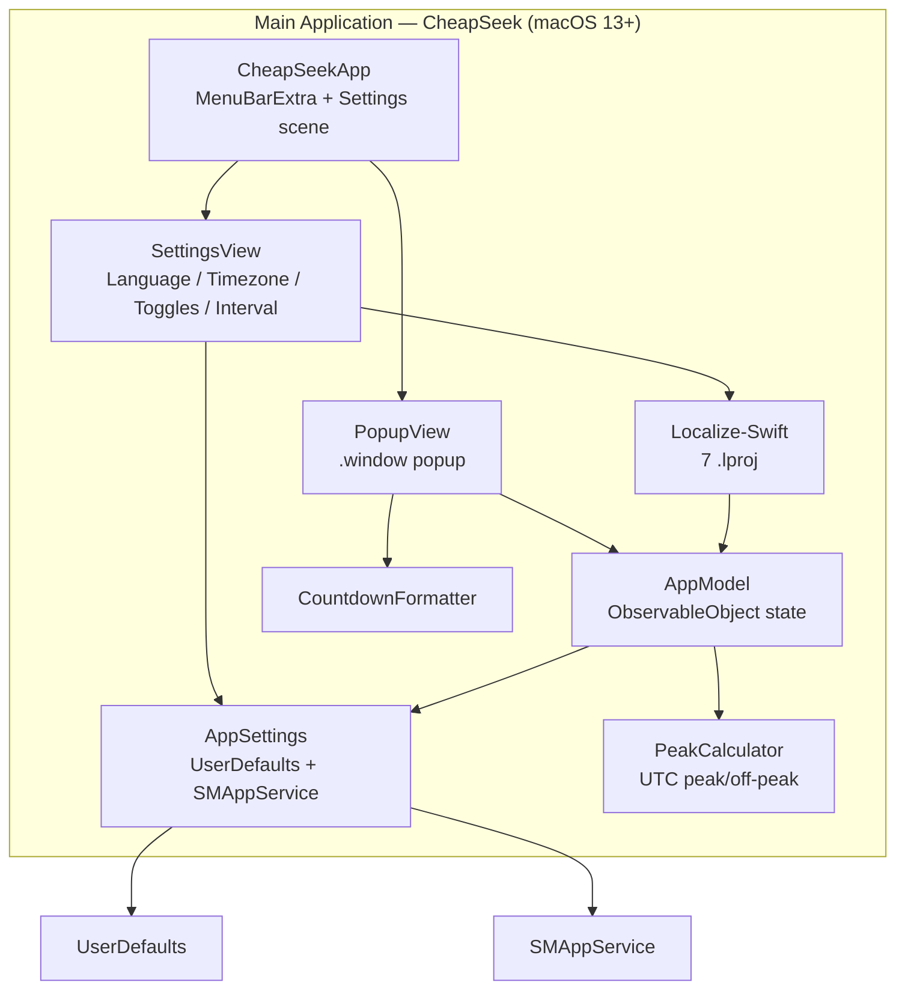

# CheapSeek

> Never pay peak prices for DeepSeek API again.

**CheapSeek** is a tiny macOS menu bar app that tells you, at a glance, whether the DeepSeek API is currently in **peak** (expensive) or **off-peak** (cheap) pricing.

When it's cheap, you code. When it's expensive, you wait. Simple.

---

## 🛠️ Tech Stack & Architecture

- **Language & Framework:** Swift 5.9 / SwiftUI, macOS 13+, `MenuBarExtra` popup (`.window` style)
- **Peak Engine:** Pure Foundation `PeakCalculator` — UTC Gregorian calendar, half-open windows (`[01:00,04:00)` & `[06:00,10:00)`, Mon–Fri; weekends off-peak)
- **State & Settings:** `AppModel` (`ObservableObject`, refresh timer) + `AppSettings` (`UserDefaults` persistence, `SMAppService` launch-at-login)
- **Localization:** 7 languages (EN / TR / DE / ES / PT / FR / IT) via Localize-Swift; live switching through `LCLLanguageChangeNotification`; system language auto-detected with English fallback
- **Design:** Semantic system colors, `.regularMaterial` popup background, light & dark mode follow the system automatically
- **Project Generation:** Declarative `project.yml` managed with [XcodeGen](https://github.com/yonaskolb/XcodeGen) for reproducible builds
- **Dependency:** Localize-Swift 3.2.0 (vendored — see note in `project.yml`)

---

## ✨ Features

- 🟢 **Live status in your menu bar** — green `coding` when cheap, red `$` when expensive
- 🧮 **Accurate peak logic** — UTC weekdays `01:00–04:00` & `06:00–10:00`, weekends always off-peak
- 🕐 **Timezone-aware** — peak hours computed in UTC, displayed in your local (configurable) timezone
- 📅 **Today's full schedule** — every peak/off-peak window for the day
- ⏳ **Next transition countdown** — "Next change in 3h 42m (to PEAK)", ticking live every second
- 🌍 **7 languages** — English 🇺🇸, Turkish 🇹🇷, German 🇩🇪, Spanish 🇪🇸, Portuguese 🇵🇹, French 🇫🇷, Italian 🇮🇹
- ⚙️ **Settings** — language, timezone, notifications toggle, launch at login, refresh interval (30–300s)
- 🌗 **Light & dark mode** — follows your system appearance automatically
- 🪶 **Minimal** — release build under 1 MB
- 🔒 **No tracking, no telemetry, no network calls**

---

## 🏗️ Architecture



### Data Flow Summary

1. **Refresh tick** — `AppModel` runs a timer at the configured interval (default 60s) and computes `isPeak` + today's schedule via `PeakCalculator` (UTC).
2. **Menu bar update** — `@Published isPeak` drives the icon: `dollarsign.circle.fill` (red) when peak, `coding` (green, monospaced) when off-peak.
3. **Popup render** — `PopupView` wraps content in a 1s `TimelineView`; each second it recomputes the next transition and the countdown via `CountdownFormatter`.
4. **Settings change** — `SettingsView` writes `AppSettings` (UserDefaults); timezone/interval propagate to `AppModel` through Combine; language changes post `LCLLanguageChangeNotification`, re-rendering all views live.
5. **Launch at login** — toggled via `SMAppService.mainApp` (`register()` / `unregister()`).

---

## 🚀 Installation & Quick Start

### 1. Prerequisites

| Requirement | Version / Notes |
| :--- | :--- |
| **macOS** | 13.0+ |
| **Xcode** | 15.0+ |
| **Project Generator** | [XcodeGen](https://github.com/yonaskolb/XcodeGen) (`brew install xcodegen`) |

### 2. Configure Settings in App

No hardcoded bundle identifiers or provisioning profiles are required. On launch the app reads saved settings (`AppSettings`); if none, it uses sensible defaults. In Settings you can change:

1. **Language** — defaults to the system language; if unsupported, falls back to English. Changes apply instantly (no relaunch).
2. **Timezone** — defaults to the system timezone; pick any IANA identifier.
3. **Refresh interval** — 30–300s (default 60s).
4. **Launch at login** — via `SMAppService`.

### 3. Run & Build

1. Generate the project first: `xcodegen generate` (`project.yml` is canonical — never edit the `.xcodeproj` by hand).
2. Open `CheapSeek.xcodeproj` in Xcode.
3. Press `Cmd + R` to build and run.

---

## 📂 Project Structure

```
CheapSeek/
├── project.yml                          # XcodeGen declarative project spec (single source of truth)
├── CheapSeek.xcodeproj/                # Generated project (do not edit by hand)
├── CheapSeek/                           # Main app target
│   ├── CheapSeekApp.swift               # @main entry: MenuBarExtra + Settings scene
│   ├── AppModel.swift                   # ObservableObject: peak status, schedule, refresh timer
│   ├── AppSettings.swift                # UserDefaults-backed settings + SMAppService
│   ├── PeakCalculator.swift             # Pure UTC peak/off-peak logic
│   ├── CountdownFormatter.swift         # Localized countdown formatting
│   ├── PopupView.swift                  # Menu bar popup (status, schedule, countdown, actions)
│   ├── SettingsView.swift               # Settings screen (language, timezone, toggles, interval)
│   ├── en.lproj/Localizable.strings     # English (23 keys)
│   ├── tr.lproj/Localizable.strings     # Turkish
│   ├── de.lproj/Localizable.strings     # Deutsch
│   ├── es.lproj/Localizable.strings     # Español
│   ├── pt.lproj/Localizable.strings     # Português
│   ├── fr.lproj/Localizable.strings     # Français
│   └── it.lproj/Localizable.strings     # Italiano
├── Packages/Localize-Swift/             # Vendored Localize-Swift 3.2.0 (local SPM package)
├── CheapSeekTests/                      # Unit tests
│   ├── PeakCalculatorTests.swift        # Peak logic, boundaries, weekends, DST
│   ├── AppSettingsTests.swift           # Defaults, clamping, persistence
│   ├── AppModelTests.swift              # State computation with injected date/timezone
│   ├── CountdownFormatterTests.swift    # Localized countdown units
│   └── LocalizationTests.swift          # 7-language key parity & completeness
├── test/test.sh                         # Test runner (xcodegen + xcodebuild test)
├── test/TestResults/                    # .xcresult bundles (gitignored; .empty keeps the dir)
├── .github/workflows/ci.yml             # CI: generate, build, test on macOS runner
└── logs/                                # Raw test logs (gitignored; .empty keeps the dir)
```

---

## 🧪 Testing & CI

```bash
./test/test.sh --list                 # show the plan without running
./test/test.sh                        # xcodegen generate + xcodebuild test
./test/test.sh --no-gen               # skip project generation
./test/test.sh --coverage             # enable code coverage
```

- Suites: `PeakCalculatorTests` (32), `AppSettingsTests` (4), `AppModelTests` (3), `CountdownFormatterTests` (5), `LocalizationTests` (2) — **46 unit tests** total.
- CI (`.github/workflows/ci.yml`, `macos-latest`): installs XcodeGen, regenerates the project, builds, and runs the full test suite on push / PR / manual dispatch. Because the only dependency is vendored locally, no SPM/network resolution is required in CI.

---

## Documentation & Architecture

### Architecture Diagrams (Archify)
Architecture and visual documentation are generated with [Archify](https://github.com/tt-a1i/archify). No diagrams have been generated for this project yet.

### Context Verification (PCP)
No [PCP](https://github.com/IsoCodeCrafter/PCP) context has been initialized for this project yet.

---

## 🔐 Permissions & Privacy

| Setting | Purpose |
| :--- | :--- |
| `LSUIElement = true` | Runs as a menu-bar-only app (no Dock icon) |
| `SMAppService.mainApp` | Optional launch-at-login (no deprecated login-item APIs) |

> **Privacy:** CheapSeek makes **no network requests** and sends **no telemetry or analytics**. All state is stored locally in `UserDefaults` (timezone, notifications toggle, refresh interval, language). Peak pricing is computed entirely on-device from the current UTC time.

---

## 📄 License

This project is licensed under the MIT License.
